# Coin Tower Topple

**Coin Tower Topple** is a 2-player game where players add coins to a tower until it gets too high and "topples". A player wins the game when their opponent causes the tower to topple.

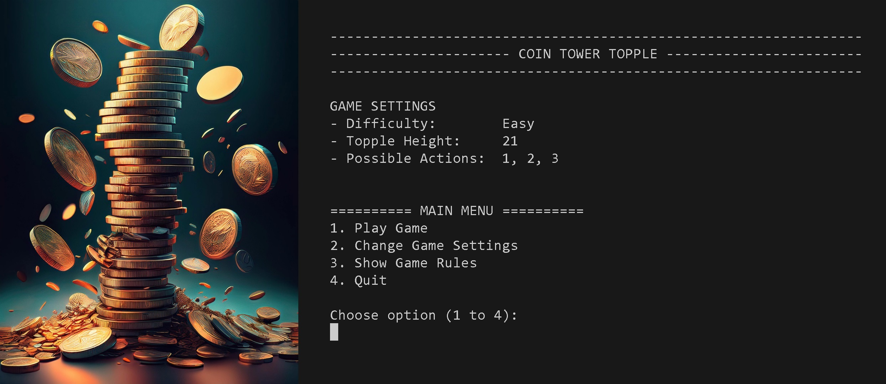

The game makes use of a machine learning technique called **Reinforcement Learning**, specifically *Q-Learning*, to train an AI agent to learn the optimal moves to maximize its chances of winning.

The game is written in Python and played in a terminal window. It is deployed on Heroku using Code Institute's mock terminal. You can access the live game <a href="https://coin-tower-topple-754aefe8d2c6.herokuapp.com/" target="_blank" rel="noopener">**here**</a>.

# Project Planning

The [**Project Planning**](project_planning.md) document outlines my personal goals for this project and includes flowcharts illustrating the code logic. I chose to create this game because:
- It provided an opportunity to explore Reinforcement Learning techniques in machine learning.
- My children and I have enjoyed playing a similar maths-based strategy game while walking to and from school!

# Target Audience

The target audience for this game is users who enjoy playing maths-based strategy games.

The game settings (*Difficulty Level*, *Topple Height*, and *Possible Actions*) can be adjusted to add variety and accommodate players of all skill levels.

# Current Features

## Program Start and Main Menu Navigation

On running the program, users are first presented with a welcome screen which shows the name of the game and the default game settings.

The user then enters the Main Menu event loop where they are shown 4 options and are prompted to choose one by entering a number.

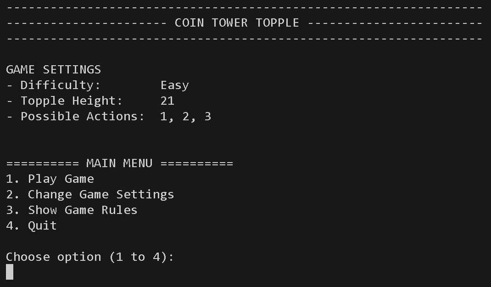

If the user enters any value other than a number within this range, they are shown an error message and prompted to enter a valid number. The image below shows what happens when a user submits an input of 'a', 'one', a null string and '5' (outside of range).

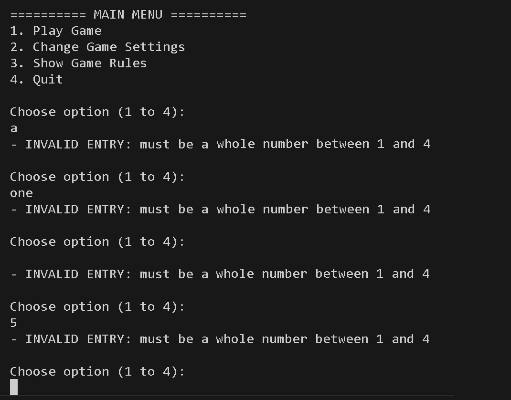

If the user enters a valid response, the appropriate action is taken. Users return to the main menu when they have finished with each action (unless they choose to quit the game using option 4).

## Play Game

When users enter '1' from the main menu, the program will initialise a game using the current game settings. Users are presented with the following screen:

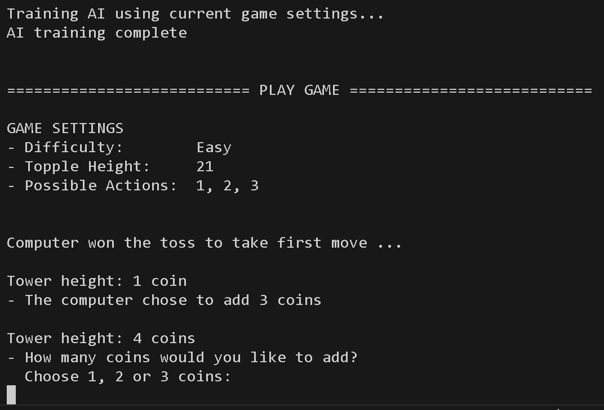

Before the user can play against the computer opponent, it first needs to be trained to learn what the optimum moves are for a game with those particular settings. This happens automatically (and takes less than a second) but the user is informed of the process. A title banner ('Play Game') is shown so that the user knows that a new game has started and the game settings are also shown to remind the user of the current configurations.

At the start of a new game, a random choice is made to decide if the user or the AI will take the first move. The user is informed about who 'won the toss'.

On each turn, the current height of the tower is displayed.
- If it is the AI's turn, the AI will choose how many coins to add to the tower from the list of possible actions
- If it is the user's turn, the user is reminded about the possible actions and prompted to enter one of them.

If the user does not enter a valid input, they are shown an error message before being prompted to enter a valid number. The image below shows what happens when a user enters 'a', 'one', '4' (outside of range), '1,2,3' and a null string.

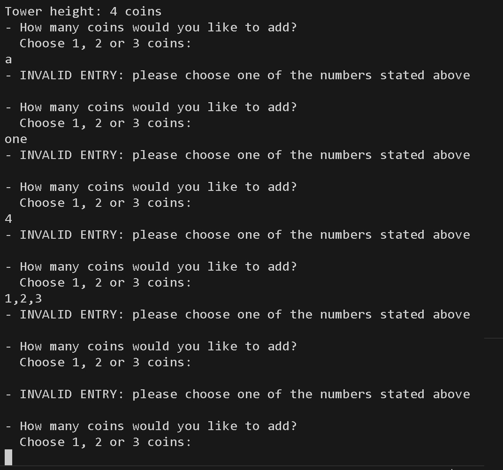

Once the user enters a valid action, the tower height is updated and the turn switches back to the AI which chooses its next move. The game repeats in this fashion until the tower topples and the user is presented with a message showing who won the game.

At the end of the game, the user is asked whether they wish to play the game again using the current game settings. If they choose 'n' (for no) then they will 'return' to the Main Menu. If they choose 'y' (for yes) then a new game will start. If they enter any other value, they will be presented with an error message and prompted to give a valid input.

The image below shows what happens when a user enters 'yes', a null string and '1'.

*Note: The AI has already been trained on the current game settings so, when the player decides to replay the game, the training process is not repeated. The AI is only trained when starting a new game from the Main Menu.*

## Change Game Settings

When users enter '2' from the main menu, the program will take the user to the Game Settings 'page'. The user is presented with a title banner ('Change Game Settings') and sequentially guided through changing the:
1. Difficult level
2. Toggle height
3. Possible actions.

The image below shows what happens when the user enters all valid inputs:

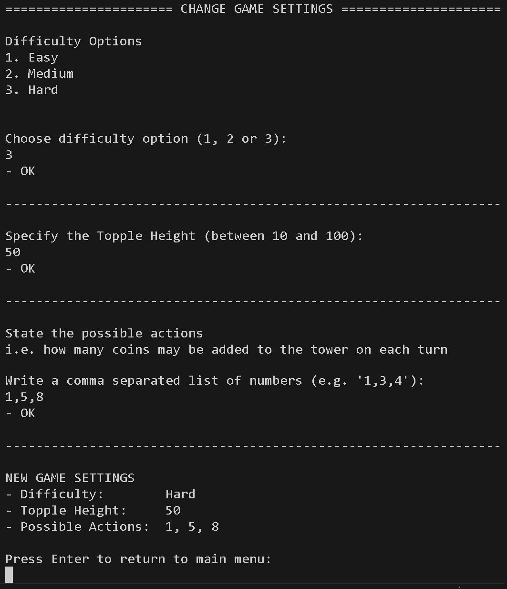

The next image shows what happens when users enter a variety of invalid inputs:

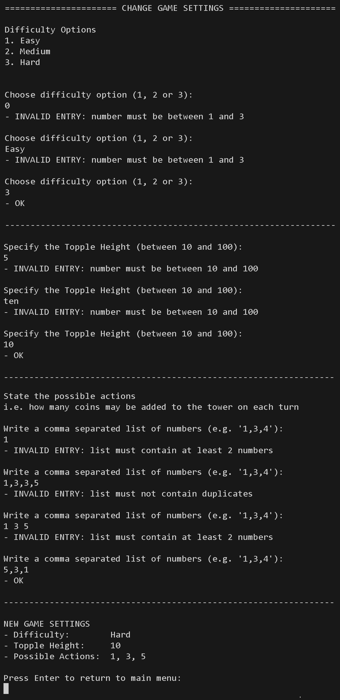

***NOTE:*** *when entering the possible actions, the order of the numbers is automatically sorted from low to high (see last user input and the summary of the new game settings in the image above). This is done to make it clearer for the user but is also required by the `_play` method in the `CoinTowerTopple` class when checking whether the opponent is forced to topple the tower on their next move.*

At the end of the process, the new game settings are shown and the user is prompted to 'return' to the main menu by pressing Enter.

## Show Game Rules

When users enter '3' from the main menu, the program will take the user to the Rules 'page'. The user is presented with a title banner ('Rules of the Game') and a summary of how to play the game.

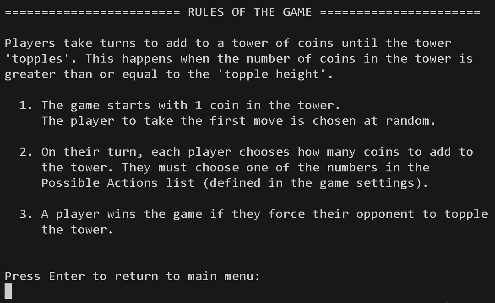

The user is prompted to 'return' to the main menu by pressing Enter.

## Quit

When users enter '4' from the main menu, the user is presented with a friendly 'goodbye' message and the program is terminated.

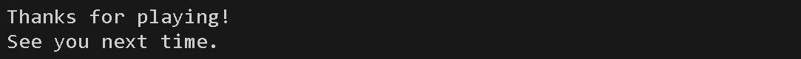

The user can restart the program if they wish by pressing the **Run Program** button.

# Deployment

The project was deployed using <a href="https://www.heroku.com/" target="_blank" rel="noopener">**Heroku**</a> using the following steps:

## 1. Login to Heroku (or create an account)

If you don't already have an account then you'll need to create one. Heroku have stopped offering their free tier service so you will also be required to enter your bank details and choose a payment plan.

The website also requires 2-factor authentication (e.g. using an authenticator app on your smartphone).

## 2. Create app

On the dashboard, click **New** > **Create new app** and follow the prompts to create a new app.

Step-by-step visual instructions

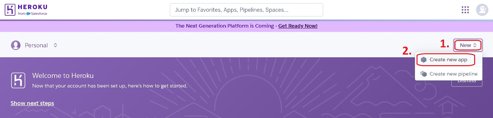

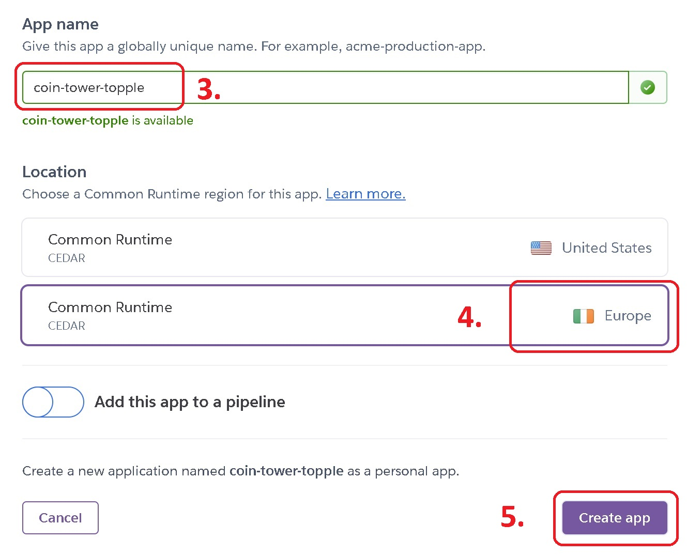

## 3. Choose App Settings

*If still on the main dashboard, click on the link for the relevant app to go to the app page.*

In the **Settings** tab:
- scroll down to the **Config Vars** section and add the following Key/Value pair:
  - KEY: **PORT**
  - VALUE: **8000**
- scroll to the **Buildpacks** section and add buildpacks for **Python** and **Nodejs** (ensuring they are in that order)

Step-by-step visual instructions

### Add Config Vars (environment variables)

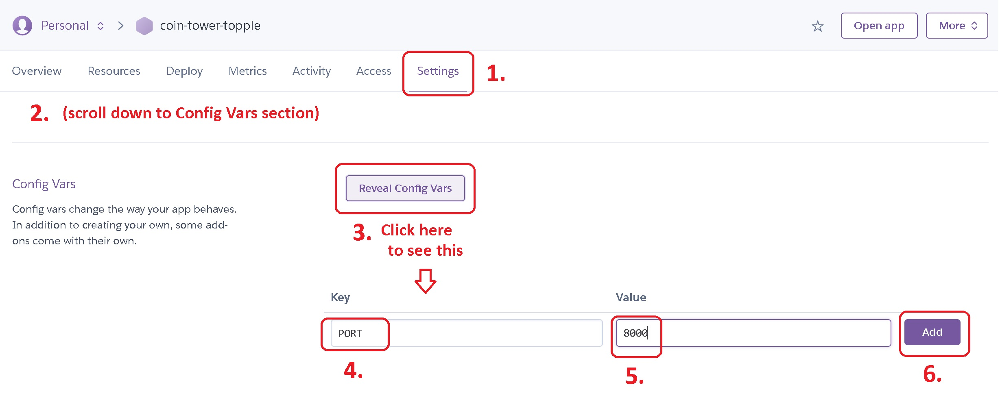

### Add Buildpacks

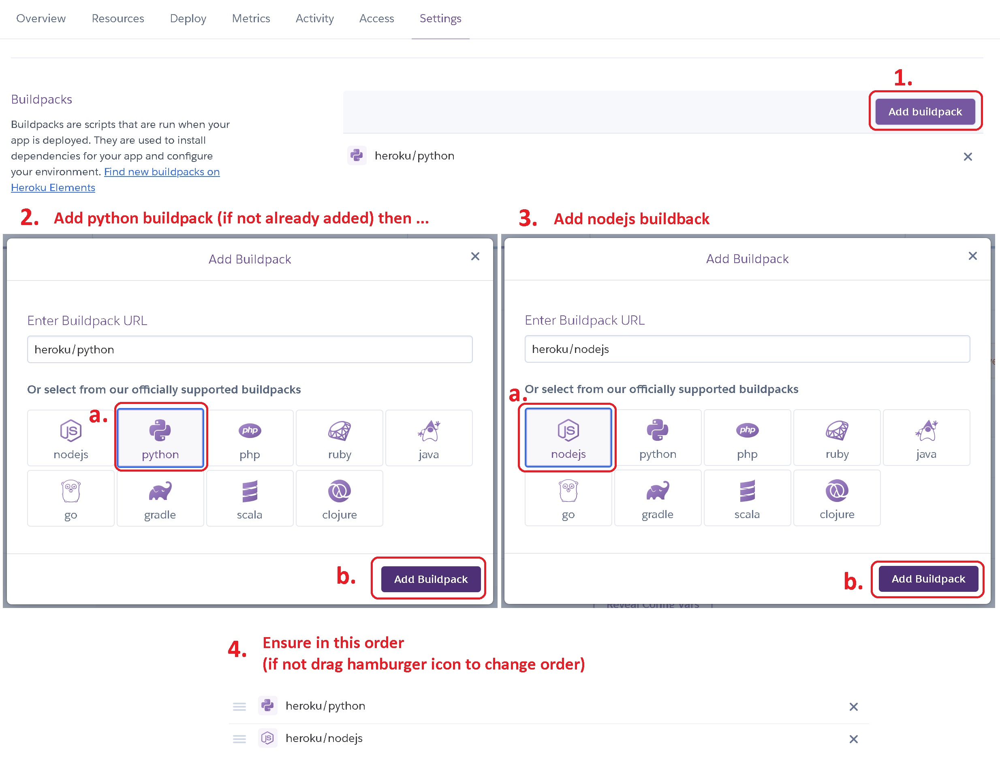

## 4. Deploy App
In the **Deployment** tab, choose Github as deployment method, connect to the relevent repository and choose your preferred method of deployment.

***NOTE:*** *I chose manual deployment so the project was not redeployed every time I made changes to the README file.*

Step-by-step visual instructions

### Set deployment method and connect to GitHub

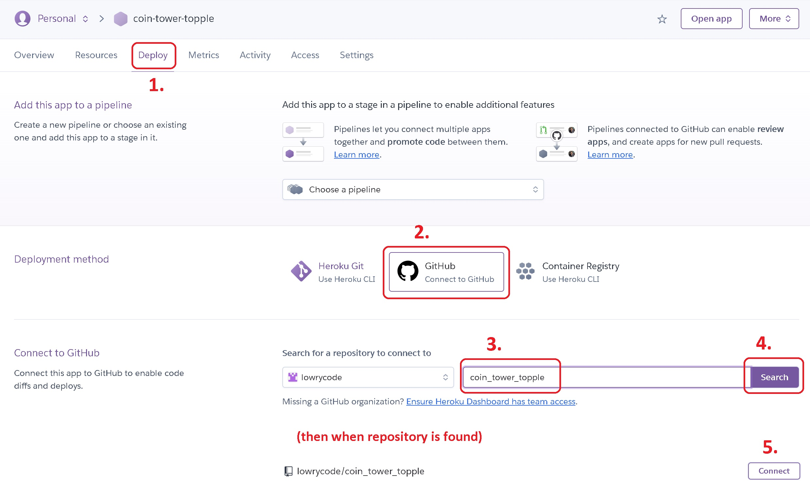

### Choose automatic or manual deployment

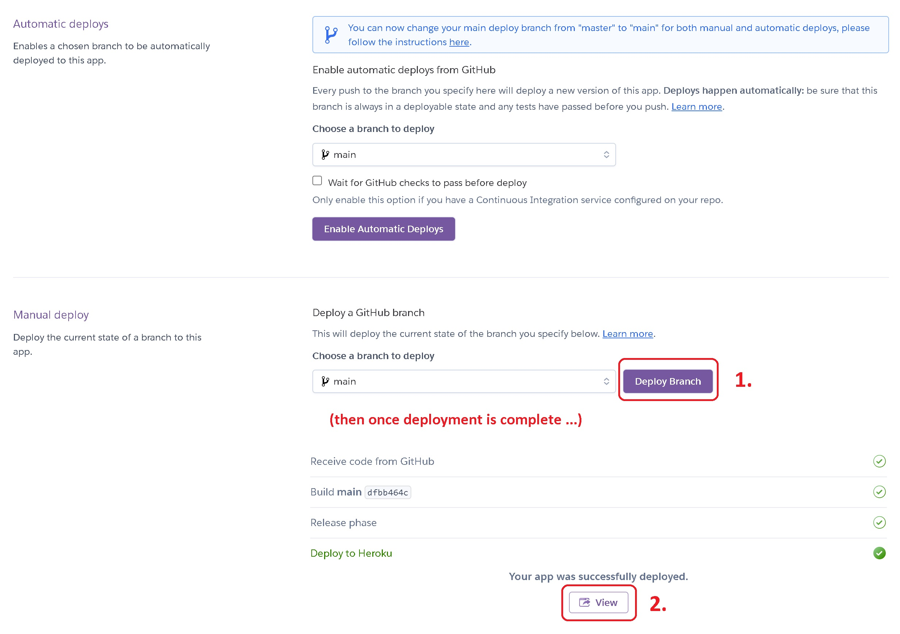

# Forking and Cloning

**Forking** refers to making a copy of the repository in your own Github account.

To fork this repository:
1. Log in to your Github account
2. Navigate to the repository page, click the caret (down arrow) next to the fork button and choose **Create a new fork**.

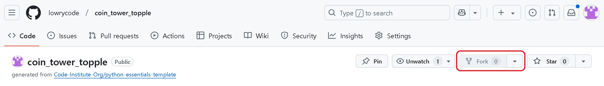

**Cloning** a repository refers to making a copy on your local machine and is typically done after forking.

To clone the repository (assuming you already have git installed on your machine):
1. Navigate to the repository page, click on the **Code** button, ensure the **HTTPS** tab is selected in the dropdown and copy the url
2. On your local machine, create the directory for the cloned repository
3. Open up a terminal window (e.g. **Git Bash** or **Command Prompt** on windows) and navigate to the new directory
4. Type **git clone [url]** (replacing [url] with the url address from step 1) and press Enter

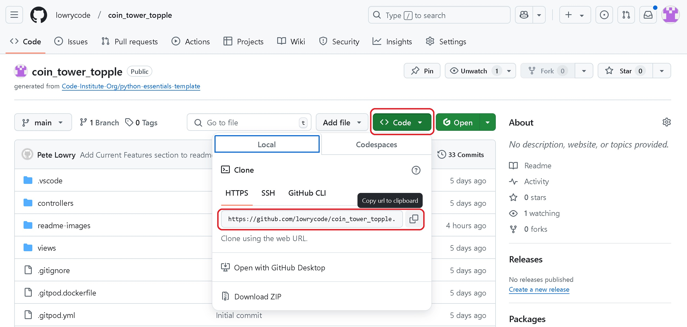
