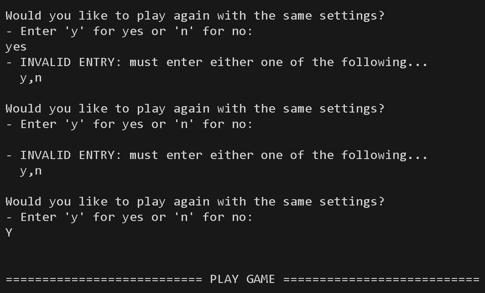
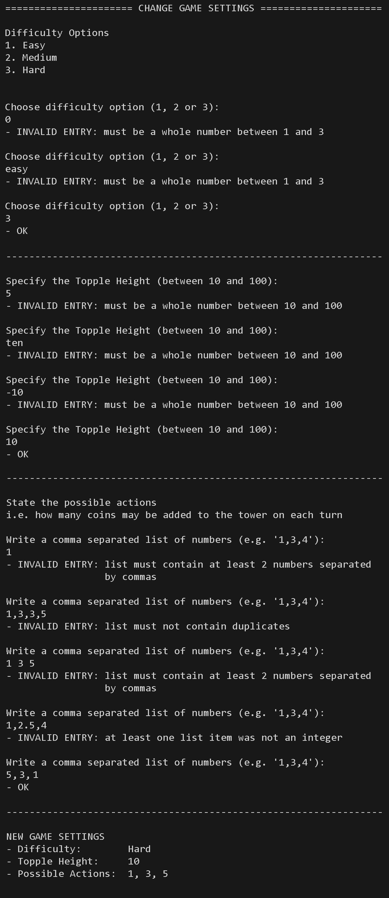

# Coin Tower Topple

**Coin Tower Topple** is a 2-player game where players add coins to a tower until it gets too high and "topples". A player wins the game when their opponent causes the tower to topple.


The game makes use of a machine learning technique called **Reinforcement Learning**, specifically *Q-Learning*, to train an AI agent to learn the optimal moves to maximize its chances of winning.

The game is written in Python and played in a terminal window. It is deployed on Heroku using Code Institute's mock terminal. You can access the live game <a href="https://coin-tower-topple-754aefe8d2c6.herokuapp.com/" target="_blank" rel="noopener">**here**</a>.

# Project Planning

The [**Project Planning**](project_planning.md) document outlines my personal goals for this project and includes flowcharts illustrating the code logic. I chose to create this game because:
- It provided an opportunity to explore Reinforcement Learning techniques in machine learning.
- My children and I have enjoyed playing a similar maths-based strategy game while walking to and from school!

# Target Audience

The target audience for the game is primarily users who enjoy playing maths-based strategy games.

The game settings (*Difficulty Level*, *Topple Height*, and *Possible Actions*) can be adjusted to add variety and accommodate players of all skill levels.

# User Experience

The following contribute to a good user experience:

## 1. **Intuitive Navigation:**
- Menus are simple, with clear prompts and logical ordering.
- Sections are clearly labelled to help the user locate themselves easily
- Users are prompted before leaving each section to make it clear that the activity has been completed
- After visiting each section, the user 'returns' to the Main Menu

## 2. **Clear and Consistent Formatting:**
- Lines never exceed the maximum column width of 80 characters (so there is no text wrapping with normal usage)
- Section labels have a consistent width
- All user inputs are on a new line
- Spacing is used to allow sections to 'breathe' and to separate different types of information

## 3. **Error Handling and User Feedback:**
- Invalid user inputs are managed effectively with supportive prompts stating how to input data in the correct format

## 4. **Efficient Procedures:**
- Processes, including AI training, run efficiently to minimise wait times.

# Current Features

## Program Start and Main Menu Navigation

On running the program, users are first presented with a welcome screen which shows the name of the game and the default game settings.

The user then enters the Main Menu event loop where they are shown 4 options and are prompted to choose one by entering a number.


If the user enters any value other than a number within this range, they are shown an error message and prompted to enter a valid number. The image below shows what happens when a user submits an input of 'a', 'one', a null string and '5' (outside of range).


If the user enters a valid response, the appropriate action is taken. Users return to the main menu when they have finished with each action (unless they choose to quit the game using option 4).

## Play Game

When users enter '1' from the main menu, the program will initialise a game using the current game settings. Users are presented with the following screen:


Before the user can play against the computer opponent, it first needs to be trained to learn what the optimum moves are for a game with those particular settings. This happens automatically (and takes less than a second) but the user is informed of the process. A title banner ('Play Game') is shown so that the user knows that a new game has started and the game settings are also shown to remind the user of the current configurations.

At the start of a new game, a random choice is made to decide if the user or the AI will take the first move. The user is informed about who 'won the toss'.

On each turn, the current height of the tower is displayed.
- If it is the AI's turn, the AI will choose how many coins to add to the tower from the list of possible actions
- If it is the user's turn, the user is reminded about the possible actions and prompted to enter one of them.

If the user does not enter a valid input, they are shown an error message before being prompted to enter a valid number. The image below shows what happens when a user enters 'a', 'one', '4' (outside of range), '1,2,3' and a null string.


Once the user enters a valid action, the tower height is updated and the turn switches back to the AI which chooses its next move. The game repeats in this fashion until the tower topples and the user is presented with a message showing who won the game.


At the end of the game, the user is asked whether they wish to play the game again using the current game settings. If they choose 'n' (for no) then they will 'return' to the Main Menu. If they choose 'y' (for yes) then a new game will start. If they enter any other value, they will be presented with an error message and prompted to give a valid input.

The image below shows what happens when a user enters 'yes', a whitespace and 'Y' (capital letter). 

***NOTE:*** *To enhance the user experience, case sensitivity is not enforced here. As a result, the last user input is considered valid and a new game begins.*



*Note: The AI has already been trained on the current game settings so, when the player decides to replay the game, the training process is not repeated. The AI is only trained when starting a new game from the Main Menu.*

## Change Game Settings

When users enter '2' from the main menu, the program will take the user to the Game Settings 'page'. The user is presented with a title banner ('Change Game Settings') and sequentially guided through changing the:
1. Difficulty level
2. Topple height
3. Possible actions.

The image below shows what happens when the user enters all valid inputs:


The next image shows what happens when users enter a variety of invalid inputs:



***NOTE:*** *When entering the possible actions list, the order of the numbers is automatically sorted from low to high (see last user input and the summary of the new game settings in the image above). This is done to make it clearer for the user but is also required by the `_play` method in the `CoinTowerTopple` class when checking whether the opponent is forced to topple the tower on their next move.*

***NOTE:*** *When entering the possible actions list, any leading and/or trailing whitespaces for list items are allowed as these are removed as part of the validation process.*

At the end of the process, the new game settings are shown and the user is prompted to 'return' to the main menu by pressing Enter.

## Show Game Rules

When users enter '3' from the main menu, the program will take the user to the Rules 'page'. The user is presented with a title banner ('Rules of the Game') and a summary of how to play the game.


The user is prompted to 'return' to the main menu by pressing Enter.

## Quit

When users enter '4' from the main menu, the user is presented with a friendly 'goodbye' message and the program is terminated.


The user can restart the program if they wish by pressing the **Run Program** button.

# Possible Future Features

Regular players may want the option to save their preferred game settings as the default, avoiding the need to manually adjust them each time. This can be easily achieved on a locally installed version (using a JSON file) but would require a login system for web-based play.

Players may also want the option to randomise topple height and possible actions, adding variety and challenge to each session. In the 'Change Game Settings' section, users could simply type 'r' to indicate that they want the setting to be randomly assigned within the permitted range.

# Python Code

The aim of this project was to build a command-line application using Python. Therefore, this section gives special consideration to the Python code itself. The [**Project Planning**](project_planning.md) document summarised my goals in demonstrating best coding practices with regards to *readability*, *maintainability* and *logic* so the code will be considered under these three headings.

## Readability

The code follows standard Python conventions (<a href="https://peps.python.org/pep-0008/" target="_blank" rel="noopener">PEP 8</a>). For example:

- **Code Indentation:** Uses 4 spaces consistently for improved readability.
- **Maximum Line Length:** Lines do not exceed 79 characters.
- **Blank Lines:**
  - Two blank lines before top-level function and class definitions.
  - One blank line between methods inside a class.
- **Imports:** Each import is on a separate line at the top of the file.
- **String Quotes:** Uses double quotes consistently, including for triple-quoted strings.
- **Whitespaces:**
  - Avoids trailing whitespaces and unnecessary spaces in empty lines.
  - Uses spaces after commas (e.g., in lists).
- **Naming Conventions:** Uses meaningful and standardized names:
  - **Variables & Functions:** Follow snake_case (e.g., calculate_score).
  - **Constants:** Use UPPER_CASE (e.g., DIFFICULTY_LEVEL_MAP).
  - **Classes:** Use PascalCase (e.g., CustomError, CoinTowerTopple).
  - **Non-Public Methods:** Prefix with a single underscore (e.g., _validate_input).
- **F-Strings:** Uses f-strings (f"{placeholder}") instead of string concatenation.
- **List Comprehensions:** Preferred over the more verbose `for` loop approach (in simple cases).
- **Comments:** clearly and concisely explain aspects of the code logic.
- **Docstrings:** Document all main functions and helper functions to improve readability and maintainability.

These practices ensure that the code is clean, readable, and easily maintainable by other Python developers.

## Maintainability

In addition to the aspects described above, the following factors contribute to the code’s maintainability and extensibility.

### Code Structure and Modularity

The code adopts an object-oriented approach which encapsulates functionalities within separate classes
- **CoinTowerTopple:** manages game logic (including user input)
- **AIPlayer:** all AI logic is handled by this class
- **CustomError:** allows for more descriptive error messages when handling input validation

Methods within these classes follow the *Single Responsibility Principle* and are therefore reusable across the application. They are categorised and organised based on their purpose.

### File Structure and Imports

Rather than writing these classes directly within the run.py file, they are imported from a separate (coin_tower_topple.py) file. This ensures a good separation of concerns and allows for the functionalities to be reused elsewhere.

No third-party libraries were used, as they were deemed unnecessary for the scope of the project and would introduce additional dependencies, potentially impacting maintainability and simplicity.

### Scalability and Flexibility

The code was written with extensibility in mind. For example, the Main Menu is dynamically generated from a `dictionary` which means that new menu options can be easily added in the future without disrupting existing functionality.

Functions allow for flexibility in how they are used. For example, the `choose_action` method in the `AIPlayer` class makes use of the `explore_fraction` parameter to control the level of randomness in decision making. This means that the same function can be used for playing games at varying levels of difficulty and also when training the AI before the game.
- `explore_fraction=0`: Used when training the AI (predicting the opponents next move) and playing games on the highest difficulty setting.
- `explore_fraction=1`: Used when training the AI (to ensure all state/action combinations are tested).
- `explore_fraction=0.33` and `explore_fraction=0.66`: Used during game play on *Easy* and *Medium* difficulty level settings respectively.

Another example of the flexibility afforded by the code structure can be seen in considering the game settings which are initialised within the `CoinTowerTopple` class. These settings can be easily modified, allowing users to customise the game to their preferences.

## Code Logic

Perhaps the most interesting aspect of the project relates to how to train the AI so that it "learns" how to win the game. The project makes use of a **Reinforcement Learning** technique called *Q-Learning*. See [**here**](training_the_ai.md) for a more detailed discussion of how this was implemented.

# Technologies Used

The code was written in **Visual Studio Code**  with the assistance of the *Flake8* linter extension.

**Git** was used as the version control system and all commits were made to the main branch.

**Github** was used to host the Git repository.

<a href="https://www.heroku.com/" target="_blank" rel="noopener">**Heroku**</a> was used for deploying the website.

The <a href="https://pep8ci.herokuapp.com/" target="_blank" rel="noopener">**CI Python Linter**</a> was used for validating the Python code.

The flow charts documenting the code logic were designed using <a href="https://www.drawio.com/" target="_blank" rel="noopener">**Draw.io**</a>. 

# Python Packages

The following Python packages were used:
- <a href="https://docs.python.org/3/library/sys.html" target="_blank" rel="noopener">**sys**</a> - to close the program when the user chooses 'Quit' from the Main Menu
- <a href="https://docs.python.org/3/library/random.html" target="_blank" rel="noopener">**random**</a> - to generate random numbers and make random choices from a list
- <a href="https://docs.python.org/3/library/pprint.html" target="_blank" rel="noopener">**pprint**</a> - to view q_values after training the AI during development (this dependency was removed before deployment)

# Testing

Manual tests were carried out throughout the development process after adding each new feature to check that it was working correctly. These tests included:
- Checking error handling by changing the values of variables to simulate errors
- Validating user inputs and testing edge cases
- Playing the game many times to check that the AI was making optimal decisions

These tests were repeated later using the deployed version to check that the program still behaved in a consistent manner. Other people were involved in testing the deployed version to ensure that the game was intuitive and clear.

## 1. Input Validation Tests

The following invalid inputs were tested to ensure that all errors were handled correctly:
- Empty inputs
- Whitespace inputs
- Lower case and upper case inputs
- Integers (outside the accepted range, including zero and negative numbers)
- floats
- strings of incorrect values (e.g. 'yes' rather than 'y')
- strings of incorrect capitalisation
- comma separated lists with less than two items
- comma separated lists with duplicate values
- comma separated lists unordered

The [Current Features](#current-features) section (above) illustrated the feedback prompts for many of these invalid entries.

## 2. Analysing the Q-Values

For certain game settings, a winning strategy can be easily deduced using simple mathematical logic. For example, if a game uses a topple height of `21` with a possible action list of `1,2,3`, the following logic could be applied.

1. A player who can pass their opponent a tower of 20 coins has won the game (since their opponent will topple the tower on their next turn).

2. It will always be possible to do this from a tower height of 19, 18, or 17 but not from 16.
   - 19 (by adding 1)
   - 18 (by adding 2)
   - 17 (by adding 3)
   - not 16 (since 4 is not one of the possible actions)

3. If a player is passed a tower height of 16 they are very likely to lose because they will pass the tower back to their opponent at a height of either 17, 18 or 19 (which are all within the reach of a tower height of 20). Therefore, a player who is able to pass their opponent a tower of height 16 is guaranteed to win the game (assuming they apply the strategy).

4. Similar logic can be applied by working backwards through the numbers and a pattern quickly emerges. Any player that can leave their opponent with a tower height of 4, 8, 12, 16 or 20 is guaranteed to win the game.

Therefore, whoever wins the toss wins the game!

But can the computer work this out? Let's have a look at the Q-table that is generated during training.

The easiest way to check is to add this script to the end of the `train` method in the `AIPlayer` class.

``` python
for s in range(1, self.topple_height):
    q_vals = [self.q_values[(s, a)] for a in self.possible_actions]
    print(f"{s}: {q_vals}")
```

The output of this code will show the q values for each action as a list (in the order `1,2,3`) at each tower height. The q_values relate to the probability of leading to future reward (i.e. winning the game).

The image below shows the q_values that were obtained during training with the game settings specified above. The output has been manually formatted to show the trends more clearly: the highest Q-value in each list has been emphasised (using a heavy font weight and underlined) to show which action the AI will choose when playing optimally.


It is clear from this data that the AI has indeed 'learned' the strategy.

A similar exercise was carried out using a variety of game settings to check that the AI training is working as expected in different scenarios, including games with very large topple heights and very long lists of possible actions. These tests revealed that the AI was playing a sufficient number of games to calculate adequate q_values and also that the training process was still very rapid.

Examples of Q-values obtained in some of these tests, alongside the rationale for choosing to use 10,000 training games can be found in the [**Analysis of Q-Values**](analysis_of_q_values.md) document.

## 3. Code Validation

The Python code was written in VS Code with the Flake8 extension turned on. This ensured that the code was formatted according to the PEP 8 conventions.

I also checked the code using the <a href="https://pep8ci.herokuapp.com/" target="_blank" rel="noopener">**CI Python Linter**</a> which presented no errors or warnings for either of the Python files.

**Validation of run.py**


**Validation of coin_tower_topple.py**


## 4. Bug Fixes

The most common bug introduced during development was failing to properly handle missing keys in the `q_values` dictionary, which uses `(state, action)` tuples as keys.

For instance, when the tower height reaches or exceeds the topple height, the game is over, so there's no need to store a value representing the probability of a future reward. In such cases, attempting to access a missing key would result in a `KeyError`.

This was easily resolved by using the `.get()` method, which provides a fallback value when a key is not found.

For example:

``` python
# This would cause a KeyError if the key doesn't exist
current_q_value = self.q_values[(state, action)]

# Using .get() returns a default value of zero instead
current_q_value = self.q_values.get((state, action), 0)
```

The other significant bug related to how errors were handled in the `_run_main_menu()` method. Early on in development, the callback functions were called within the `try` block.

``` python
# Main Menu Event Loop ...
while True:
    try:
        # User input and validation goes here ...
        # ...
        
        # Callback methods were (wrongly) executed here
        self.main_options[response][1]()

    except (KeyError, ValueError):
        # error handling goes here ...
```

The issue with this approach was that any unhandled runtime errors within a callback function would propagate up to `_run_main_menu()` and be masked by the generic except block. This made debugging difficult, especially for `KeyError` bugs like the ones described earlier.

To fix this, the callback method was moved outside the `try` block and placed in an `else` block instead:

``` python
# Main Menu Event Loop ...
while True:
    try:
        # User input and validation goes here ...
        # ...

    except (KeyError, ValueError):
        # error handling goes here ...
    else:
        # Callback methods are now executed here
        self.main_options[response][1]()
```

This ensures that only input-related errors are caught, while unexpected errors inside the callback functions remain visible for debugging.

No known bugs remain in the deployed version.

# Deployment

The project was deployed using <a href="https://www.heroku.com/" target="_blank" rel="noopener">**Heroku**</a> using the following steps:

## 1. Login to Heroku (or create an account)

If you don't already have an account then you'll need to create one. Heroku have stopped offering their free tier service so you will also be required to enter your bank details and choose a payment plan.

The website also requires 2-factor authentication (e.g. using an authenticator app on your smartphone).

## 2. Create app

On the dashboard, click **New** > **Create new app** and follow the prompts to create a new app.

<details>

<summary>Step-by-step visual instructions</summary>


</details>

## 3. Choose App Settings

*If still on the main dashboard, click on the link for the relevant app to go to the app page.*

In the **Settings** tab:
- scroll down to the **Config Vars** section and add the following Key/Value pair:
  - KEY: **PORT**
  - VALUE: **8000**
- scroll to the **Buildpacks** section and add buildpacks for **Python** and **Nodejs** (ensuring they are in that order)

<details>

<summary>Step-by-step visual instructions</summary>

### Add Config Vars (environment variables)


### Add Buildpacks


</details>

## 4. Deploy App
In the **Deployment** tab, choose Github as deployment method, connect to the relevent repository and choose your preferred method of deployment.

***NOTE:*** *I chose manual deployment so the project was not redeployed every time I made changes to the README file.*

<details>

<summary>Step-by-step visual instructions</summary>

### Set deployment method and connect to GitHub


### Choose automatic or manual deployment


</details>

# Forking and Cloning

**Forking** refers to making a copy of the repository in your own Github account.

To fork this repository:
1. Log in to your Github account
2. Navigate to the repository page, click the caret (down arrow) next to the fork button and choose **Create a new fork**.


**Cloning** a repository refers to making a copy on your local machine and is typically done after forking.

To clone the repository (assuming you already have git installed on your machine):
1. Navigate to the repository page, click on the **Code** button, ensure the **HTTPS** tab is selected in the dropdown and copy the url
2. On your local machine, create the directory for the cloned repository
3. Open up a terminal window (e.g. **Git Bash** or **Command Prompt** on windows) and navigate to the new directory
4. Type **git clone [url]** (replacing [url] with the url address from step 1) and press Enter


# Credits

This <a href="https://www.youtube.com/watch?v=-g0iJjnO2_w" target="_blank" rel="noopener">**YouTube video**</a> by **Harvard University** was particularly informative and inspirational when considering the focus for this project. The video provides an excellent introduction to machine learning with a section on Q-learning (starting at 1:19:56) which clearly explains the intuition behind the process. The section also demonstrates how Q-learning can be applied to a game called Nim; this demonstration was particularly inspirational due to the similarities between that game and Coin Tower Topple.

The following resources were helpful in giving further information about Q-learning:
- This <a href="https://www.simplilearn.com/tutorials/machine-learning-tutorial/what-is-q-learning" target="_blank" rel="noopener">**article**</a> was useful in defining the terms that are commonly used.
- This <a href="https://www.geeksforgeeks.org/q-learning-in-python/" target="_blank" rel="noopener">**article**</a> on the **geeksforgeeks** website was helpful in summarising the main components of Q-learning and illustrated a possible Python implementation. However, it implied that *Temporal Difference* and *Bellman's Equation* were distinct approaches to updating Q-values and therefore introduced some confusion on this point.
- This <a href="https://eitca.org/artificial-intelligence/eitc-ai-arl-advanced-reinforcement-learning/deep-reinforcement-learning/function-approximation-and-deep-reinforcement-learning/examination-review-function-approximation-and-deep-reinforcement-learning/what-is-the-bellman-equation-and-how-is-it-used-in-the-context-of-temporal-difference-td-learning-and-q-learning/" target="_blank" rel="noopener">**article**</a> helped to clarify the relationship between *Bellman's Equation* and *Temporal Difference*.

Other helpful resources included:
- This <a href="https://realpython.com/documenting-python-code/" target="_blank" rel="noopener">**article**</a> by **James Mertz** gives really useful information about docstrings and best practices for documenting code.

# Acknowledgments

The website was developed as part of the **Full Stack Developer Course** at <a href="https://codeinstitute.net/" target="_blank" rel="noopener">**Code Institute**</a> and was submitted as my third portfolio project. I would like to thank my mentor <a href="https://www.linkedin.com/in/precious-ijege-908a00168/" target="_blank" rel="noopener">**Precious Ijege**</a> for his encouragement and advice, particularly in pointing me in the right direction with regards to best practices in documenting Python code.