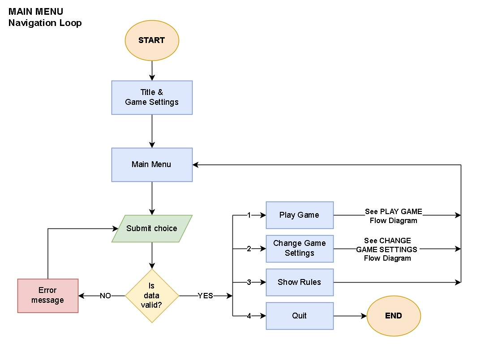
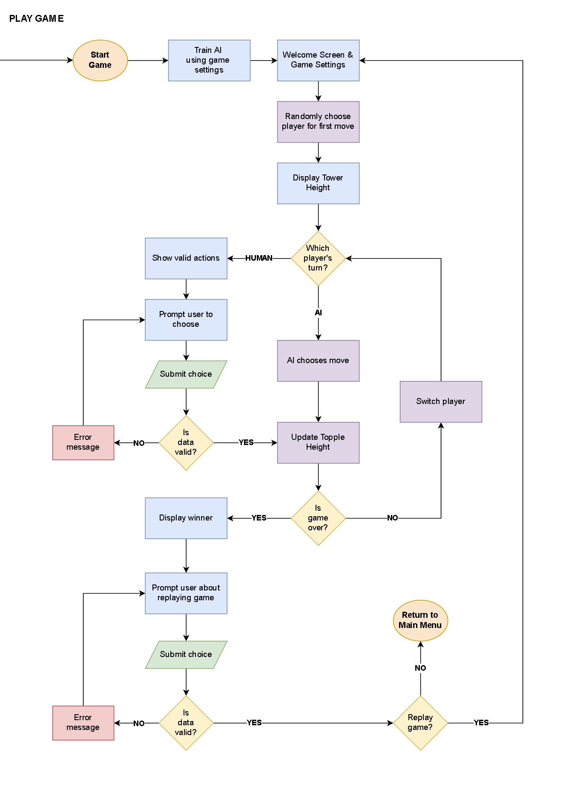
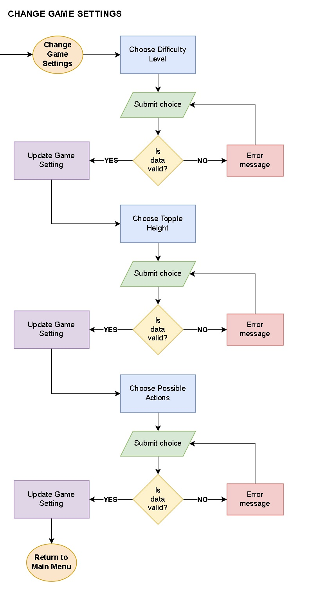

# PROJECT PLANNING

## Personal Goals
In this third portfolio project I aim to demonstrate proficiency with the Python language by developing a maths-based strategy game that can be played in a terminal window.

I hope to demonstrate best coding practices, particularly with regards to:
- **Readability** - following PEP 8 conventions (e.g. snake_case, 4 lines for indentation, max 79 characters per row, etc.)
- **Maintainability** - using an object oriented approach for organising code, documenting code (using docstrings and comments)
- **Logic** - efficient procedures/algorithms, appropriate data structures, handling exceptions, DRY principle

I decided to build a maths-strategy game which expands on a simple game that my children and I enjoy playing on our way to school. My hope is that they will enjoy playing this game and develop their mathematical strategy skills further.

Having learnt a little about machine learning algorithms, I was keen to explore these ideas further. The game is well suited to a technique called **Reinforcement Learning**, specifically *Q-Learning*, in which an AI plays against itself many times to learn the optimal moves which maximise its chances of winning the game.

## How To Play The Game

In this 2 player game, players take turns to add to a tower of coins until the tower 'topples'. This happens when the number of coins in the tower is greater than or equal to the 'topple height'.

1. The game starts with 1 coin in the tower. The player to take the first move is chosen at random.

2. On their turn, each player chooses how many coins to add to the tower. They must choose one of the numbers in the Possible Actions list (defined in the game settings).

3. A player wins the game if they force their opponent to topple the tower.

## Intended Features

- **MUST HAVE** - Users can play the game against a computer

- **MUST HAVE** - Users can view the game rules

- **SHOULD HAVE** - Users can change the game settings (e.g. difficulty, topple height, possible actions)

- **COULD HAVE** - Users can ask the program to randomly select certain game settings (e.g. topple height and possible actions)

## Code Logic

The following flow charts show a high level overview of the code logic.

***NOTE:*** *The flow chart showing the logic for how the AI is trained is included in a [**separate document**](training_the_ai.md) which discusses this process in more detail*