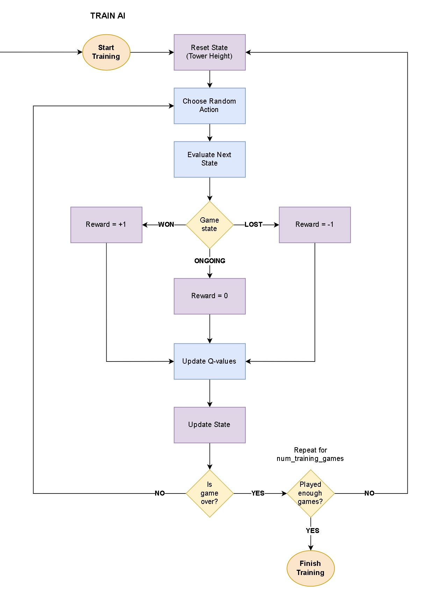

# Training the AI

## Theoretical Foundations of AI Learning

### Reinforcement Learning?

This project makes use of a machine learning approach called **Reinforcement Learning** (RL), in which an AI agent learns to make optimal decisions by interacting with its environment. The agent takes actions, receives feedback (in the form of rewards or penalties), and adjusts its strategy over time to maximise cumulative rewards.

### Q-Learning

**Q-Learning** is a type of Reinforcement Learning that follows a model-free approach, meaning the AI agent doesn't need any prior knowledge of the environment. Instead, it learns an optimal *policy* by exploring predefined possible actions and updating values in a **Q-table** based on the feedback it receives. These values, called **Q-values**, estimate the expected cumulative reward for taking a specific action in a given state.

### How This Applies to the Game

- The **agent**: The AI making decisions about how many coins to add to the tower.
- The **environment**: The tower itself, where:
  - The **state** represents the current height of the tower.
  - The **possible actions** represent the number of coins that can be added.
- The agent receives:
  - A **penalty** if its action causes the tower to reach or exceed the Topple Height.
  - A **reward** if its action forces the opponent into a situation where they must exceed the Topple Height on their turn.

### What the Q-Table Looks Like

The Q-table holds a Q-value for each possible state-action combination. 

For example, if the game uses a **Topple Height** of `11` with a **Possible Actions** list of `1,2,3`, the Q-Table would look something like this:

| State | Action 1 | Action 2 | Action 3 |
| ----- | ----- | ----- | ----- | 
| 1 | 0.25 | -0.25 | -0.25 |
| 2 | -0.25 | -0.25 | -0.25 |
| 3 | -0.25 | -0.25 | 0.5 |
| 4 | -0.25 | 0.5 | -0.5 |
| 5 | 0.5 | -0.5 | -0.5 |
| 6 | -0.5 | -0.5 | -0.5 |
| 7 | -0.5 | -0.5 | 1.0 |
| 8 | -0.5 | 1.0 | -1.0 |
| 9 | 1.0 | -1.0 | -1.0 |
| 10 | -1.0 | -1.0 | -1.0 |

***NOTE:*** *There is no need to record values for expected future reward for states greater than or equal to the Topple Height as the game is now over*

The same Q-table can be represented with a Python `dictionary` where the:
- **key** is a `(state, action)` **tuple**
- **value** is the **Q-value**

``` python
q_values = {
    (1,1): 0.25, 
    (1,2): -0.25,
    (1,3): -0.25,
    (2,1): -0.25,
    (2,2): -0.25,
    (2,3): -0.25,
    (3,1): -0.25,
    (3,2): -0.25,
    (3,3): 0.5,
    (4,1): -0.25,
    (4,2): 0.5,
    (4,3): -0.5,
    (5,1): 0.5,
    (5,2): -0.5,
    (5,3): -0.5,
    (6,1): -0.5,
    (6,2): -0.5,
    (6,3): -0.5,
    (7,1): -0.5,
    (7,2): -0.5,
    (7,3): 1.0,
    (8,1): -0.5,
    (8,2): 1.0,
    (8,3): -1.0,
    (9,1): 1.0,
    (9,2): -1.0,
    (9,3): -1.0,
    (10,1): -1.0,
    (10,2): -1.0,
    (10,3): -1.0
}
```

### How to Update Q-Values

Initially, a default Q-value of zero is assigned to each of the possible state-action combinations. The Q-values are updated incrementally using an approach called **temporal difference learning**. This method, based on Bellman's equation, updates Q-values by calculating the *difference* between the *current estimated reward* and the *future estimated reward*.

A simplistic way of representing this approach can be expressed using the following formula:

***Q(s,a) ← current estimate + α (future estimate - current estimate)***

where:
- ***Q(s,a)*** is the *Q-value* (or more strictly the Q-function that returns this value) for state ***s*** and action ***a***
- ***current estimate*** is the current Q-value ***Q(s,a)***
- ***future estimate*** which takes into account the current reward obtained by taking action ***a*** and the Q-value for the best action in the next state ***Q(s',a')***
- **α** is the learning rate which controls how much new information influences the update
  - `α=1`: The update is based only on new experiences (ignoring past experiences)
  - `α=0`: The Q-value is based only on past experiences and would therefore never be updated (since new experiences are ignored)

The same formula could be expressed more precisely as:

***Q(s,a) ← Q(s,a) + α (r + γ max Q(s',a') - Q(s,a))***

where ***r + γ max Q(s',a')*** is the future estimated reward.
- ***r*** is the **immediate reward** and can be assigned:
  - a **positive value** if the action led to **winning** the game
  - a **negative value** if the action led to **losing** the game
  - **zero** if the action did neither of the above
- ***γ*** is the **discount factor** and allows for further control as to how much weight is given to future rewards:
  - `𝛾=0`: The agent only considers the immediate reward ***r***
  - `γ=1`: The agent values future rewards just as much as immediate rewards

### Taking the Opponent Into Account

It took me a while to realise that when calculating the expected future reward, the immediate next state will be played by the opponent. Therefore, it is not desirable to update the current Q-value based on the opponent's next state but rather the state that follows that one.

In other words, rather than calculating the future reward using ***r + γ max Q(s',a')***, we need to consider the state after that. I like to think of it as a desire to calculate ***r + γ max Q(s'',a'')*** where ***s''*** is the state that the opponent will pass back to the AI and ***max Q(s'',a'')*** is the highest Q-value for all possible actions in that new state.

In order to achieve this, the assumption was made that the opponent would always play optimally by choosing the action with the highest Q-value out of all the possible actions.

## Python Implementation of AI Training

When the user chooses option 1 from the main menu ("Play Game"), the `_play` method of the `CoinTowerTopple` class is called. Before the game starts, it is first necessary to train the AI on the current game settings. All of the logic relating to the AI training and decision making is contained within the `AIPlayer` class which is instantiated at the beginning of the `_play` method by passing the current game settings as arguments and assigned to a variable named `ai`. The `train` method is then called, specifying the number of training games as an argument.

``` python
def _play(self):
    # Initialise AI with current game settings
    ai = AIPlayer(
        self.difficulty_level,
        self.topple_height,
        self.possible_actions
    )

    # Train AI (to get q_values)
    ai.train(10000)

    # Game begins here
    # ...
```

When the `ai` object is first instantiated, the constructor method initialises a Q-table (called `self.q_values`) with default values of zero. It is the responsibility of the `train` method to update these values so that the AI can make intelligent decisions in the context of the game.

### Outline of the `train` Method

The method simulates playing multiple games (`num_training_games`) using a for loop.

On each iteration:
1. A new game is initialised by assigning:
    - `state = 1`: The height of the tower is reset to 1 coin
    - `game_over = False`: This flag is used to indicate when the game has ended
2. The game loop repeats until the `game_over` flag is set to True
    - A random action is chosen by calling the `choose_action` method
    - The opponent's next state is calculated
    - The next state is evaluated to:
        - assign an appropriate **reward** value
        - update the `game_over` flag (if necessary)
    - The Q-value for the current `(state, action)` is updated based on the assigned reward by calling the `_update_q_value` method
    - The current state is updated to reflect the chosen action

The flow chart below shows a visual summary of this process.



### A Closer Look at the `choose_action` Method

In reinforcement learning, there are two strategies that are used to guide decision making:
- **Exploration:** Discover new actions that might lead to better rewards
- **Exploitation:** Use past experiences to choose the best-known action for maximising future rewards

Different strategies are applied in different contexts within the project. For example:
- **Exploration** is used when training the AI to ensure that all possible state-action combinations are explored
- **Exploitation** is used when predicting an opponents next move (during AI training) and in game-play

To control which strategy is applied in a given context, the `choose_action` method uses a parameter called `explore_fraction` which states the probability of a particular strategy being employed.
- `explore_fraction = 1`: Use for **full exploration** 
- `explore_fraction = 0`: Use for **full exploitation**
- `explore_fraction = 0.8`: 80% chance of **exploration**, 20% chance of **exploitation**

In the context of training the AI, `explore_fraction = 1` ensures that all possible state-action combinations are considered. However, when updating Q-values, `explore_fraction = 0` is used to predict what the opponent's next move will be, assuming they are playing optimally.

When applying the exploitation strategy, it will sometimes be the case that multiple actions have the same highest Q-value. To ensure that Q-values are calculated accurately over time, it is important that there is no bias introduced (e.g. by always choosing the first of these) so the method ensures that a random choice is made between these equally good actions.

### A Closer Look at the `_update_q_value` Method

As discussed above, the formula used to update Q-values can be written as follows:

***Q(s,a) ← Q(s,a) + α (r + γ max Q(s',a') - Q(s,a))***

This formula is implemented within the `_update_q_value` method using the following Python statement:

``` python
current_q_value += LEARNING_RATE * (reward + (DISCOUNT * expected_future_reward) - current_q_value)
```

The values assigned to the constants, along with the rationale for choosing these, are as follows:
- `LEARNING_RATE = 0.8`: The AI learns quickly by prioritising new information whilst not ignoring past experiences
- `DISCOUNT = 0.5`: Immediate rewards are given slightly more weight since they are more certain than future rewards

Analysis of Q-values confirmed that the AI was learning effectively and therefore suggested that these values are suitable.

In order to estimate the future reward (`expected_future_reward`) it is necessary to predict the next state that the AI will play from (after the opponent has taken their next move). This is done using the following steps:
1. Deduce the opponent's next state (`opponent_state`)
2. Find the opponent's best action via the `choose_action` method (using `explore_fraction = 0`)
3. Deduce the AI's next likely state (`expected_next_state`)

Once the expected_next_state has been computed, it is simply a matter of finding the highest Q-value for all possible actions in that state. This was achieved using the `_get_max_future_reward` helper method.